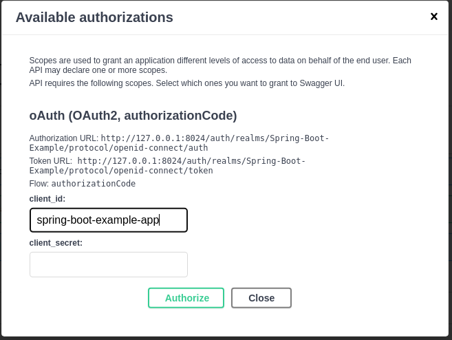
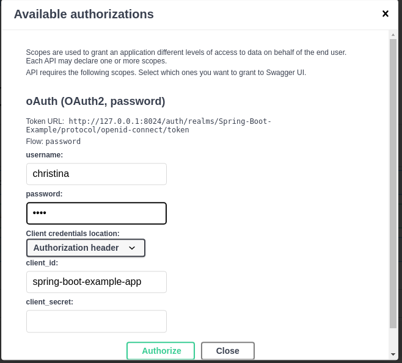
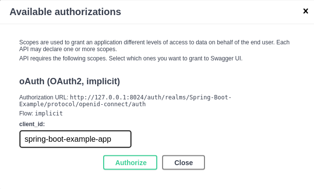

# spring-boot-swagger-ui-keycloak

[](https://keepgrowing.in/)

## About this project

This Spring Boot project shows an example configuration of Springdoc and Keycloak Spring Boot adapter that ensures that
only authenticated users can call secured endpoints available through Swagger UI:



* client_id: `spring-boot-example-app`
* client_secret should be left empty

## Getting started

First, [clone](https://docs.github.com/en/github/creating-cloning-and-archiving-repositories/cloning-a-repository-from-github/cloning-a-repository)
this repository.

Then, build it locally with:

```shell
mvn clean install
```

You can run the app in a command line with the following command:

```shell
mvn spring-boot:run
```

You can run the `keycloak` container with the following commands:

```shell
cd docker
docker-compose up -d
```

### Running tests

You can run tests with:

```shell
mvn test
```

The MVC tests use Spring Boot Security not Keycloak. The `HttpSecurity` configuration stays the same.

### Credentials

#### For the Keycloak admin

* username: `admin`
* password: `admin`

#### For example users of this app

* available usernames: `christina`, `hanna`, `carlo`, `noel`
* password: `test`
* `christina` has the `chief-operating-officer` realm role that is required to call the `POST: /api/products` endpoint

The `keycloak` service starts with the default realm imported from the
[docker/keycloak/realms/realm-export.json](docker/keycloak/realms/realm-export.json) file that specifies all the default
users.

### Visit API documentation

Make sure that the app is running.

* Swagger UI: [http://localhost:8080/swagger-ui.html](http://localhost:8080/swagger-ui.html)
  (click the `Authorize` button and log in as an example user of the `spring-boot-example-app` client to test secured
  endpoints, the client is `public` so you don't need to fill the `client_secret` field)
* OpenAPI specification: [http://localhost:8080/v3/api-docs](http://localhost:8080/v3/api-docs)

### Visit Keycloak

Make sure that the `keycloak` container is up.

* Admin panel: [http://localhost:8024/auth](http://localhost:8024/auth) (log in as the Keycloak admin [`admin:admin`])
* As an admin you can see a list of users associated with the `Spring-Boot-Example` realm by clicking
  the `View all users` button on the
  [http://localhost:8024/auth/admin/master/console/#/realms/Spring-Boot-Example/users](http://localhost:8024/auth/admin/master/console/#/realms/Spring-Boot-Example/users)
  page.
* What's more, you can log in as any user associated with the `Spring-Boot-Example` realm by clicking the `Sign in`
  button on the
  [http://localhost:8024/auth/realms/Spring-Boot-Example/account](http://localhost:8024/auth/realms/Spring-Boot-Example/account)
  page.
* The realm roles are available under
  the [http://localhost:8024/auth/admin/master/console/#/realms/Spring-Boot-Example/roles](http://localhost:8024/auth/admin/master/console/#/realms/Spring-Boot-Example/roles)
  url.

## Features

* Application secured with Keycloak
* Swagger UI available for everyone but only authenticated users can call secured endpoints
* Only users with `chief-operating-officer` realm role can call the `POST: /api/products` endpoint
  (this role is assigned to `christina` by default)
* OpenAPI 3 specification

### Experimental Authorization configurations for Swagger UI

We can enable/disable specific application properties to run the app with different configurations.

Prior to `springdoc-openapi v1.6.6`, the Swagger configs for the `OpenID Connect Discovery` scheme,
the `Authorization Code` and `Password` flows didn't work
with [Spring Boot csrf protection enabled for Springdoc](https://springdoc.org/#how-can-i-enable-csrf-support). The
issue was fixed
in [CSRF header should not be sent to cross domain sites](https://github.com/sebastien-helbert/springdoc-openapi/commit/a9cea74b832e639da0433c7e3eaf0025ebcce9c9)
PR and this project uses this fix.

#### Swagger UI with OpenID Connect Discovery scheme

To enable the Swagger Authentication config for
the [OpenID Connect Discovery scheme](https://swagger.io/docs/specification/authentication/openid-connect-discovery/),
edit the `application.properties` file so that it contains:

```
security.config.openid-discovery=true
security.config.authcode-flow=false
```

Alternatively, run the app with the following command:

```shell
mvn spring-boot:run -Dspring-boot.run.arguments="--security.config.openid-discovery=true --security.config.authcode-flow=false"
```

The result:


#### Swagger UI with Resource Owner Password flow

To enable the Swagger Authentication config for
the [Password Flow](https://swagger.io/docs/specification/authentication/oauth2/), edit the `application.properties`
file so that it contains:

```
security.config.password-flow=true
security.config.authcode-flow=false
```

Alternatively, run the app with the following command:

```shell
mvn spring-boot:run -Dspring-boot.run.arguments="--security.config.password-flow=true --security.config.authcode-flow=false"
```

The result:



#### Swagger UI with Implicit flow

This flow is deprecated[^1]

To enable the Swagger Authentication config for
the [Implicit Flow](https://swagger.io/docs/specification/authentication/oauth2/), edit the `application.properties`
file so that it contains:

```
security.config.implicit-flow=true
security.config.authcode-flow=false
```

Alternatively, run the app with the following command:

```shell
mvn spring-boot:run -Dspring-boot.run.arguments="--security.config.implicit-flow=true --security.config.authcode-flow=false"
```

The result:



[^1]: *Why not Implicit flow* in [How to authorize requests via Postman](https://keepgrowing.in/tools/kecloak-in-docker-7-how-to-authorize-requests-via-postman)

## Built With

* [Spring Boot v2.6+](https://spring.io/projects/spring-boot)
* [Maven](https://maven.apache.org/)
* [Keycloak](https://www.keycloak.org/)
* [Keycloak Spring Boot adapter](https://www.keycloak.org/docs/latest/securing_apps/#_spring_boot_adapter)
* [springdoc-openapi](https://springdoc.org/)
* [Docker Compose](https://docs.docker.com/compose/)
* [Dummy4j](https://daniel-frak.github.io/dummy4j/)
